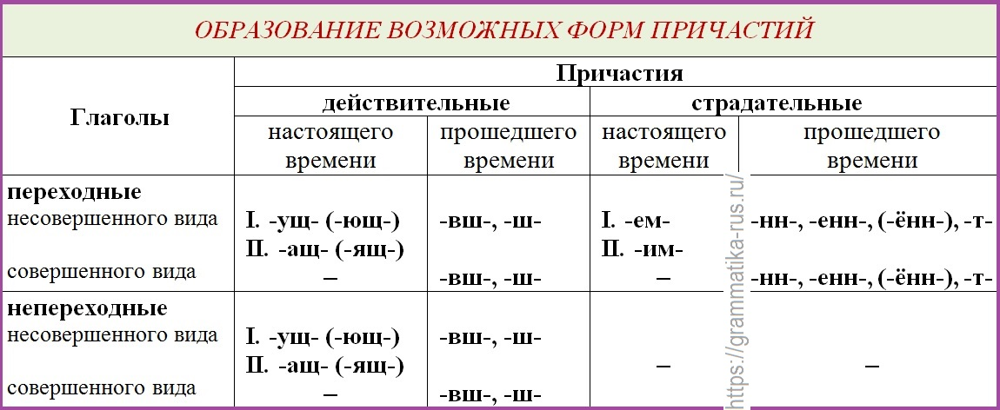

И другие существа

# Суффиксы причастий + образование

# Вводность

Союзы `а, и,` реже `но,` если они составляют одно целое с последующим вводным словом, не отделяются запятой, например
*А значит, а следовательно, но стало быть, но конечно и т. п.*

# Исключения причастия
Названый брат, посажёный отец, смышлёный ребенок
Деланный, желанный, жеманный, медленный, священный, чванный, чеканный
Невиданный, негаданный, нежданный, неслыханный, нечаянный, недреманный и нек. др.

Кованый, жёваный, клёваный
Подкованный, разжёванный, исклёванный

# Интересные штучки
Оба - собирательное числительное
Вчетверо <- от слова четверо (приставочно-суффиксальный)
Если хотите знать, я тренируюсь каждый день. Простое предложение [ ]
Вестибюль
Жесток <- корень + окончание
Треть - существительное
Фойе - ср. род
